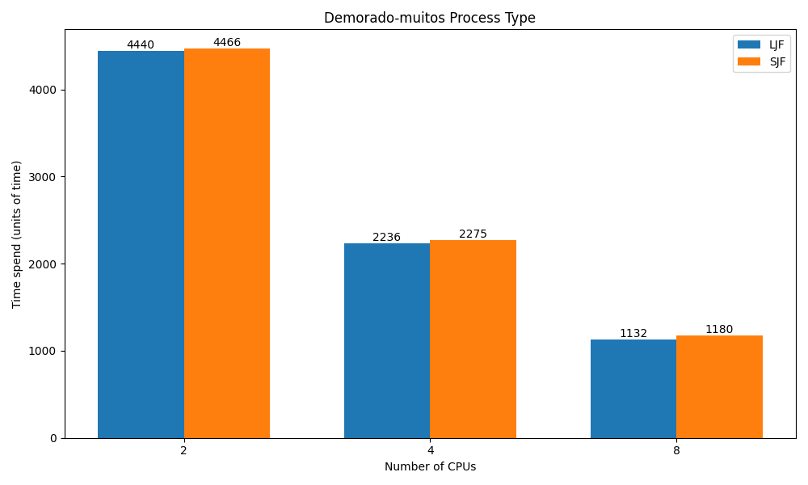

# Scheduler Simulator

## Project Overview

Welcome to the Scheduler Simulator project! This project is a homework assignment for the "Sistemas Operacionais" (Operating Systems) course. The Scheduler Simulator is a Java-based application designed to simulate the behavior of different CPU scheduling algorithms. The simulator reads a list of fake processes from a text file and executes them using a specified number of CPUs.

## Features

- Simulates various CPU scheduling algorithms.
- Reads process data from a text file.
- Supports multi-core CPU simulation.
- Unit tests implemented using JUnit.
- Built using Maven for easy dependency management and build automation.

## Requirements

- Java Development Kit (JDK) 8 or higher
- Maven 3.6.0 or higher

## Results


The results obtained (images are bellow) indicate that LJF (Longest Job First) generally performs better (with shorter processing times) compared to SJF (Shortest Job First). SJF only approaches the performance of LJF when there is a very large number of processes.

This makes sense because the ideal scenario is where all processors consume the same amount of time. Therefore, it is easier to achieve this balance by selecting the high-impact processes first and then fine-tuning with the smaller processes.

> You can check all benchmarks on https://github.com/dpnunez/scheduler-simulation/tree/main/src/main/resources/cases




## Project Structure

```
scheduler-simulator/
│
├── pom.xml
├── src
│   ├── main
│   │   ├── java
│   │   │   └── org
│   │   │       └── example
│   │   │           ├── Main.java
│   │   │           ├── Process
│   │   │           │   ├── Process.java
│   │   │           │   └── ProcessUtils.java
│   │   │           └── Scheduling
│   │   │               ├── CPU.java
│   │   │               ├── SJF.java
│   │   │               ├── SJFReverse.java
│   │   │               └── Scheduler.java
│   │   └── resources
│   │       └── tarefa.txt
│   └── test
│       └── java
│           └── org
│               └── example
│                   ├── SchedulerTest.java
│                   └── UtilsTest.java
```

## Usage

### Easy Setup

Pick a IDE of your choice and import the project as a Maven project. The IDE should automatically download the required dependencies and set up the project.

> _Important_: Make sure that you are passing the 2 required parameters when running the simulator. The first parameter is the path to the input file, and the second parameter is the number of CPUs to simulate.

### Manual Setup

#### Building the Project

To build the project, navigate to the project root directory and run:

```bash
mvn package
```

#### Running the Simulator

To run the simulator, use the following command:

```bash
java -cp target/scheduler-simulator-1.0-SNAPSHOT.jar org.example.Main <filepath> <number_of_cpus>
```

- `<filepath>`: Path to the text file containing the process data.
- `<number_of_cpus>`: The number of CPUs to simulate (integer).

### Example

```bash
java -cp target/scheduler-simulator-1.0-SNAPSHOT.jar org.example.Main src/main/resources/tarefa.txt 4
```

### Input File Format

The input file should contain process information in the following format:

```
<id> <duration>
```

Each process should be on a new line. For example:

```
a 20
b 15
c 10
```

### Output File Format

The output file will detail the execution of processes on each CPU. The format is as follows:

```
Processador_1
<id>;<start_time>;<end_time>
<id>;<start_time>;<end_time>

Processador_2
<id>;<start_time>;<end_time>
```

Each CPU's processes will be listed separately. For example:

```
Processador_1
a;0;10
c;10;40

Processador_2
b;0;15
```

## Testing

To run the unit tests, execute:

```bash
mvn test
```

## License

This project is licensed under the MIT License. See the LICENSE file for more details.

## Acknowledgements

This project is part of the "Sistemas Operacionais" course curriculum. Special thanks to the course instructors and teaching assistants for their support and guidance.

## Contact

For any questions or inquiries, please contact:

- Daniel Pôrto Núñez
- daniel.portonunez@gmail.com
